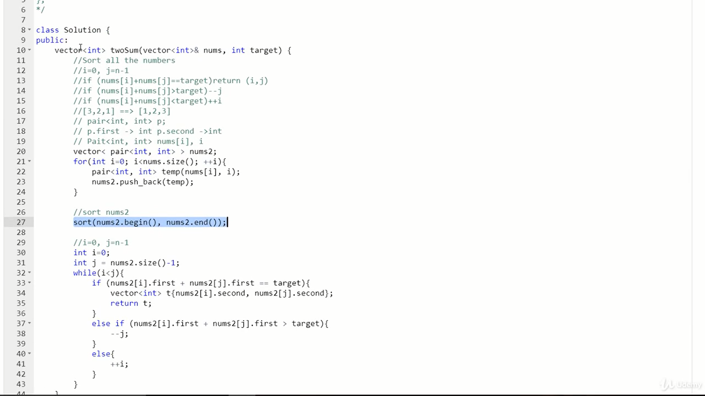
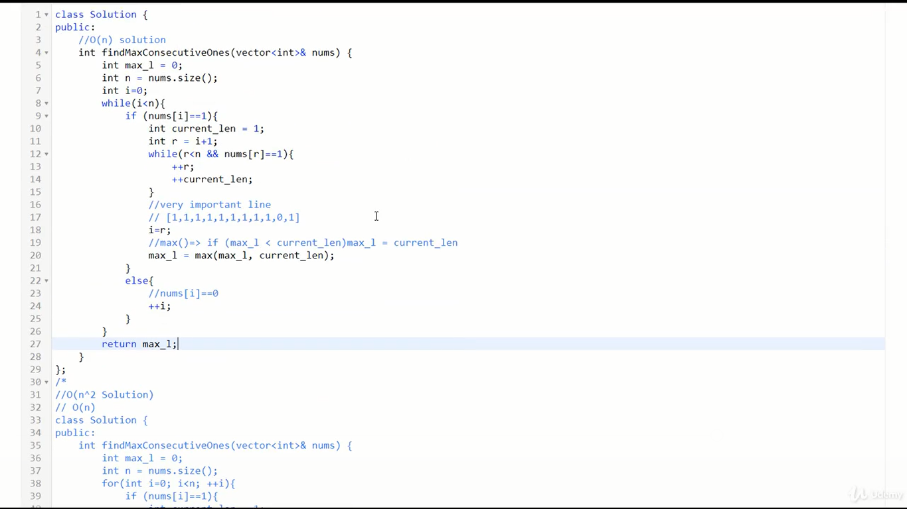
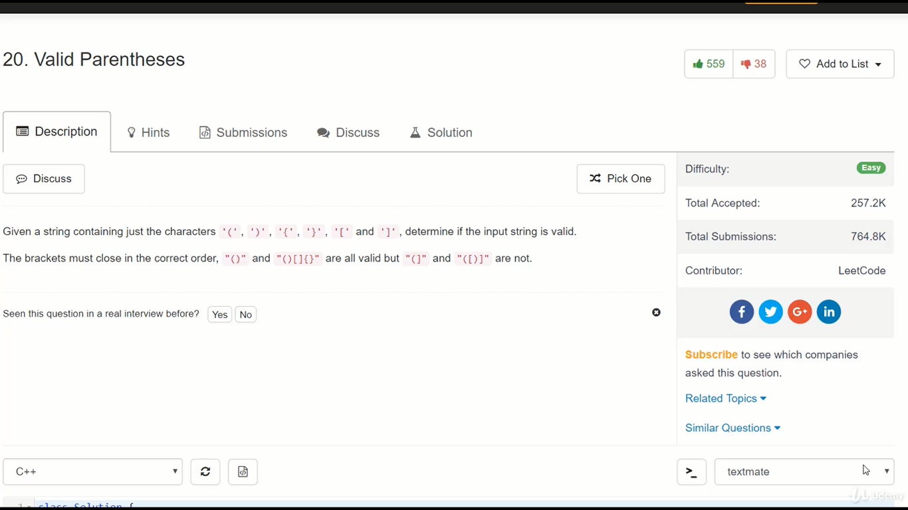
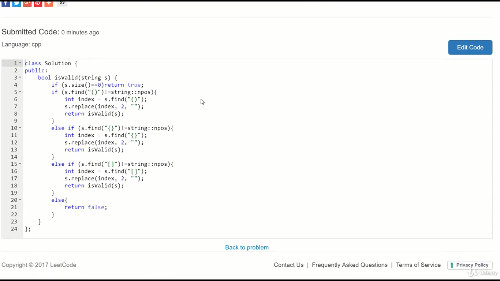
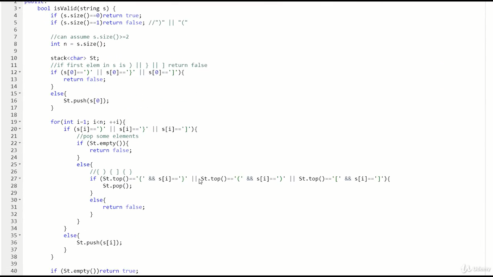
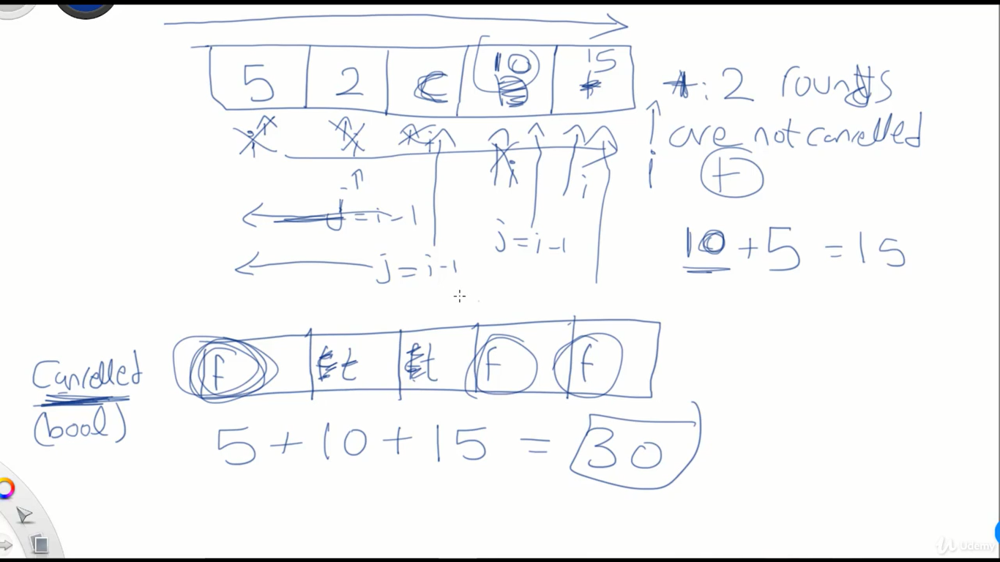

1. Given an array of integers, return indices of the two numbers such that they add up to a specific target.

You may assume that each input would have exactly one solution, and you may not use the same element twice.

[Two Sum](https://leetcode.com/problems/two-sum/)




---


2. Consecutive number of ones


---





3. 


4. 






5. 




### Problem statement 28


**Contains duplicate**


```c++


unordered_map<int,int> h;


for (int i = 0; i < count; ++i)
{
	if(h.find(A[i])!=h.end()){
		if(h[A[i]]-i<=k){
			h[A[i]]=i;
		}
		else{
			return false;
		}
	}
	else{
		h[A[i]]=i;
	}
}


```


### Anagram

```c++
#include <bits/stdc++.h>
using namespace std;

int main(){

    string s="hellop";
    string t="hellok";
    int *flags=(int *)malloc(sizeof(int)*(s.length()));
    for(int i=0;i<s.length();i++){
        flags[i]= false;
    }

    for (int k = 0; k < s.length(); ++k) {
        cout<<flags[k]<<" ";
    }
    cout<<endl;

    for (int j = 0; j < s.length(); ++j) {
        for (int i = 0; i < t.length(); ++i) {
            cout<<s[j]<<"  "<<t[i]<<endl;
            if((s[j]==t[i]) && (flags[j]==false)){

                flags[j]=true;
                break;
            }
        }
    }

    for (int k = 0; k < s.length(); ++k) {
        cout<<flags[k]<<" ";
    }


    return 0;
}
```


**More intuitive way to do the above**


```c++
string s,t;
vector<bool> matched(t.size(),false);
for (int i = 0; i < s.size(); ++i)
{
    for (int j = 0; j < t.size(); ++j)
    {
        if(s[i]==t[j]&& !matched[j]){
            matched[j]=true;
            break;
        }

    }
}

for (int i = 0; i < t.size(); ++i)
{
    if(!matched[i]){
        return false;
    }
}

return true;
```


**Can be optimized**

*nlogn solution simply sort both strings and return if(s==t)*

```c++

if(s.length()!=t.length()){
    return false;
}
sort(s);
sort(t);
return s==t;

```


**nlogn** 


*further optimization using hashmap*

---

1. Implementation using hashmap

---

```c++
#include <bits/stdc++.h>
using namespace std;

int main(){

    unordered_map<char,int> H;

    string s="hello";
    string t="hello";

    for (int i = 0; i < s.length(); ++i) {
        H[s[i]]++;
    }
    for (int i = 0; i < t.length(); ++i) {
        H[t[i]]++;
    }
    for(auto x:H){
        if (x.second!= 0)
            cout<<"false";
    }


    return 0;
}


```


2. Implementation using vector,which outnumber the hashmap because hash() is used by the
latter . 


```c++

string s;
string t;
vector <int> H(128,0);
for (int i = 0; i < s.length(); ++i)
{
    H[s[i]]++;
}
for (int i = 0; i < t.length(); ++i)
{
    H[t[i]]--;
}
for(auto x:H){if(x!=0) return false;}
return true;
```